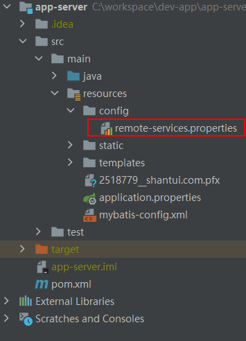

# springboot 读取自定义 properties 配置文件方法

## 1. 添加依赖

添加 pom.xml 依赖

```xml
<!-- springboot configuration 依赖 -->
        <dependency>
            <groupId>org.springframework.boot</groupId>
            <artifactId>spring-boot-configuration-processor</artifactId>
        </dependency>
```

## 2. 创建配置信息

在 resources 下建一个 创建 `config/remote-services.properties`



在配置文件中写入配置信息

```
remote.oaHrm = http://172.16.64.61/services/EmailService?wsdl
```

## 3. 创建配置类

编写一个实体类, 属性和配置文件对应

```java
package com.shantui.config;

import lombok.Data;
import org.springframework.boot.context.properties.ConfigurationProperties;
import org.springframework.context.annotation.Configuration;
import org.springframework.context.annotation.PropertySource;

/**
 * @author ChuanShen
 * Create Date: 2020/8/17 15:45
 * Description:
 **/
@Configuration
@ConfigurationProperties(prefix = "remote", ignoreUnknownFields = false)
@PropertySource("classpath:config/remote-services.properties")
@Data
public class RemoteServicesProperties {
    private String oaHrm;
}
```
- `@Configuration` 声明是一个配置文件类
- `prefix = "remote"` 设置配置文件的睡醒前缀
- `ignoreUnknownFields = false` 不忽略未匹配的字段, 抛出异常 

## 4. 使用配置信息类

如下使用 配置信息类

```java
@EnableConfigurationProperties(RemoteServicesProperties.class)
@SpringBootTest
public class AppServerApplicationTest {

    @Autowired
    RemoteServicesProperties remoteServicesProperties;

    @Test
    void test() {
        System.out.println(remoteServicesProperties.getOaHrm());
    }
}

```

- 注解 `@EnableConfigurationProperties(RemoteServicesProperties.class)` 引用配置文件类
- 使用 `@Autowired` 获取 `RemoteServicesProperties` 类的实例.
- 使用 `remoteServicesProperties.getOaHrm()` 获取属性值.